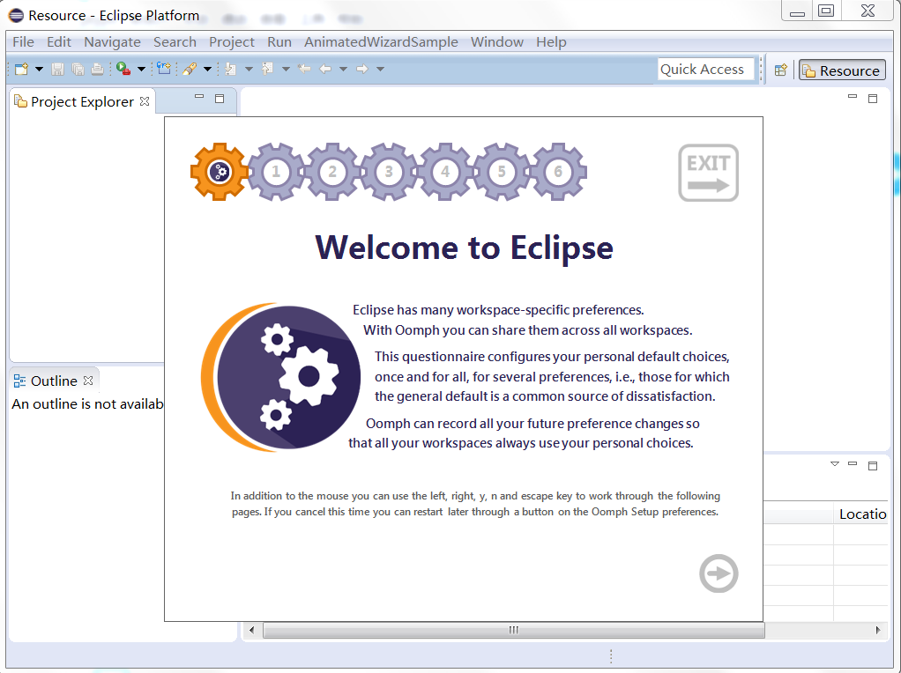

# AnimatedWizardSample

Hey ide guys , I've extracted the oomph beautiful wizard to a plugin for our future ui of code upgrade tool , you can clone my repo and import it into eclipse and debug it.
Go to Menu->AnimatedWizardSample->AnimatedWizardSample and you will see the result.

Following is the effect screen shot

